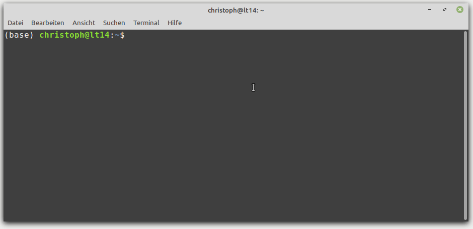

# Typora Launch Recent
Launch your Typora notes from everywhere using the CLI and autocomplete.



## Idea
Want to start [Typora](https://typora.io/) from the terminal but not type the full file path?

This script adds [autocomplete](https://kislyuk.github.io/argcomplete/) with all your recent markdown files!

##  Features
1. Use `tlr xy<tab>` to open recently modified markdown files
2. Create new markdown files with an instant title based on the file name
3. List all recent markdown files using `tlr --list`

## Installation
```bash
cd typora_launch_recent
pip3 install argcomplete
cp tlr ~/.local/bin/
chmod +x ~/.local/bin/tlr
echo 'eval "$(register-python-argcomplete tlr)"' >> ~/.bashrc
```